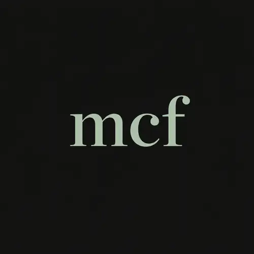

# MCF and Theoria



Portable, AI-assisted courses that ordinary people can create, compile, share, and study—even with limited internet or older devices.

## Live demo

- Theoria deployment: https://theoria-core.vercel.app/
- Demo video: https://youtu.be/BJ82EfvfspM

## Repositories

- Central submission repo: https://github.com/apv022/buildweek-submission
- MCF specification: https://github.com/apv022/mcf-spec
- TypeScript compiler (`mcf-npm`): https://github.com/apv022/mcf-npm
- Python compiler (`mcf-python`): https://github.com/apv022/mcf-python
- Sample courses: https://github.com/apv022/mcf-samples
- Theoria Core: https://github.com/apv022/theoria-core

## What this project is

MCF (Modular Curriculum Format) is an open, human-readable course source format.

The project includes:

1. **MCF 1.0 specification** — the source-format standard.
2. **mcf-npm** — the reference TypeScript compiler.
3. **mcf-python** — an independent Python compiler.
4. **mcf-samples** — canonical sample courses.
5. **Theoria** — a browser-first learning, authoring, validation, and compilation PWA.

## Problem

Educational content is often locked behind accounts, constant internet access, modern hardware, and centralized platforms. That creates a barrier for disadvantaged children and for the ordinary people who want to create and share learning material with their communities.

## Solution

MCF makes courses portable. A course can be authored as structured source, validated, compiled, shared, copied to a USB drive, opened locally, or transferred to a phone.

Theoria is intended to become for MCF what Acrobat became for PDF: the familiar app people use to open, study, create, validate, and manage the format.

## Key capabilities

### MCF compilers

Both compilers consume the same MCF source and can:

- validate a course;
- generate a static multi-file course library; and
- generate a standalone HTML course.

The standalone HTML target was designed with Android in mind, making it easy to transfer and open an entire course on a phone.

### Theoria

Theoria is a browser-only PWA that lets users:

- browse bundled courses;
- study complete courses with progress saved locally;
- create and edit MCF courses in the browser;
- inspect the course tree;
- validate and compile MCF source; and
- export portable course packages.

## Judge instructions

No account or credentials are required.

1. Open https://theoria-core.vercel.app/
2. Browse and open a bundled course.
3. Complete a notes, practice, or assessment activity.
4. Confirm progress persists locally.
5. Open **Compile** to import an MCF ZIP and export a compiled course.
6. Open **Create** to inspect the browser-based authoring workflow.

## Development tools

### mcf-npm

```bash
npm install
npm run mcf -- validate ../mcf-samples/showcase
npm run mcf -- compile ../mcf-samples/showcase --output ../courses
```

### mcf-python

```bash
python3 -m venv .venv
source .venv/bin/activate
pip install -e .
python -m mcf_compiler validate ../mcf-samples/showcase
python -m mcf_compiler compile ../mcf-samples/showcase --output ../courses
```

## How OpenAI tools were used

- **GPT-5.6** was used to refine the specification, reason through course semantics and educational structure, and guide architectural decisions.
- **Codex** accelerated implementation, testing, debugging, documentation, synchronization across repositories, and polish work.

## What was built during Build Week

- finalized the MCF 1.0 specification;
- completed two independent compilers;
- consolidated and validated the sample-course corpus;
- added standalone HTML compilation;
- built and deployed Theoria as a browser-only PWA; and
- created the demo and submission materials.

## License

Unless otherwise stated in the linked repositories, see the license files in the individual project repositories.
